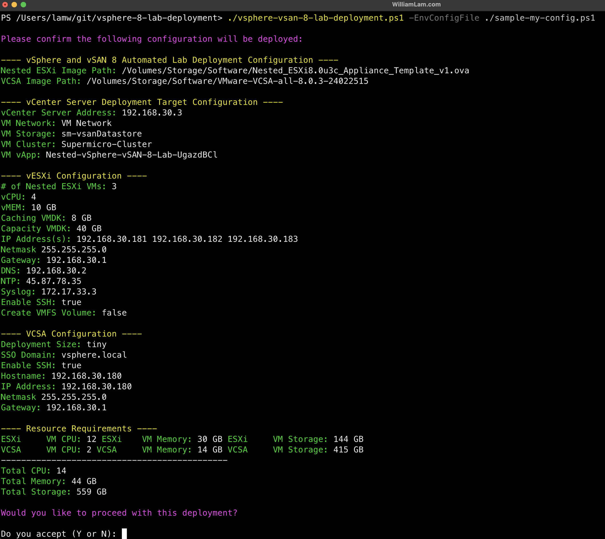
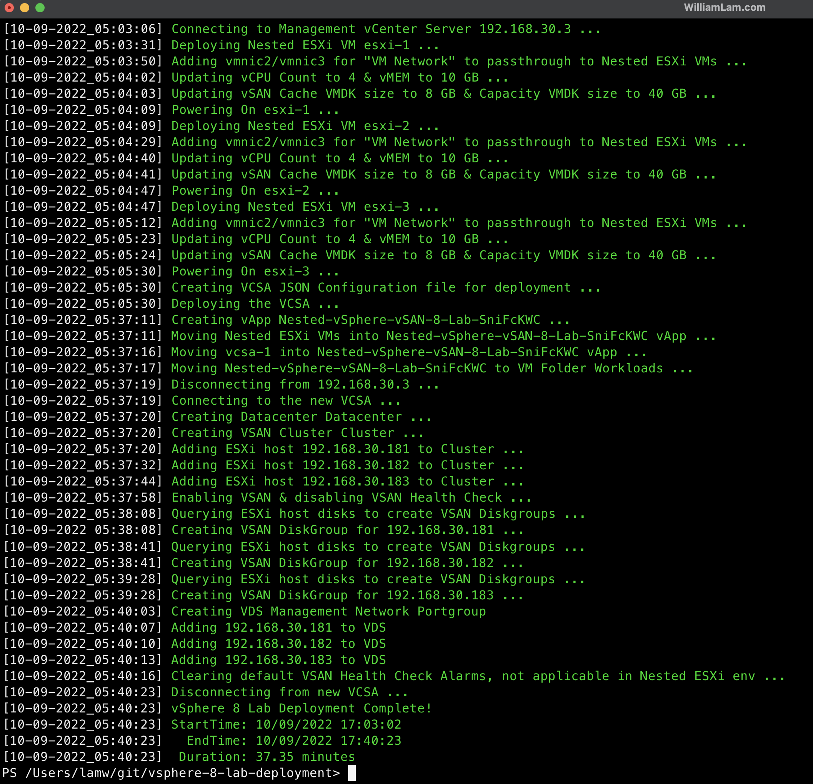
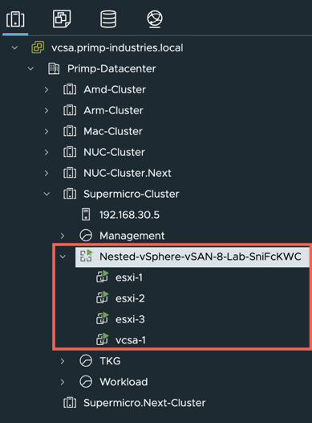

# Automated vSphere & vSAN 8 Lab Deployment

## Table of Contents

* [Description](#description)
* [Changelog](#changelog)
* [Requirements](#requirements)
* [Configuration](#configuration)
* [Logging](#logging)
* [Sample Execution](#sample-execution)

## Description

Similar to previous "Automated Lab Deployment Scripts" (such as [here](https://www.williamlam.com/2016/11/vghetto-automated-vsphere-lab-deployment-for-vsphere-6-0u2-vsphere-6-5.html), [here](https://www.williamlam.com/2017/10/vghetto-automated-nsx-t-2-0-lab-deployment.html), [here](https://www.williamlam.com/2018/06/vghetto-automated-pivotal-container-service-pks-lab-deployment.html), [here](https://www.williamlam.com/2020/04/automated-vsphere-7-and-vsphere-with-kubernetes-lab-deployment-script.html) and [here](https://www.williamlam.com/2020/10/automated-vsphere-with-tanzu-lab-deployment-script.html)), this script makes it very easy for anyone to deploy a vSphere 8.x environment for learning and educational purposes.

Below is a diagram of what is deployed as part of the solution and you simply need to have an existing vSphere environment running that is managed by vCenter Server and with enough resources (CPU, Memory and Storage) to deploy this "Nested" lab.


## Changelog

* **02/28/2025**
  * Externalize user variables to configuration files
* **10/11/2022**
  * Initial Release

## Requirements
* vCenter Server running at least vSphere 7.x or later
    * If your physical storage is vSAN, please ensure you've applied the following setting as mentioned [here](https://www.williamlam.com/2013/11/how-to-run-nested-esxi-on-top-of-vsan.html)
* ESXi Networking
  * Enable either [MAC Learning](https://williamlam.com/2018/04/native-mac-learning-in-vsphere-6-7-removes-the-need-for-promiscuous-mode-for-nested-esxi.html) or [Promiscuous Mode](https://kb.vmware.com/kb/1004099) on your physical ESXi host networking to ensure proper network connectivity for Nested ESXi workloads
* DRS-enabled Cluster (not required but vApp creation will not be possible)
* Desktop (Windows, Mac or Linux) with latest PowerShell Core and PowerCLI 12.1 Core installed. 
    * See [ instructions here](https://blogs.vmware.com/PowerCLI/2018/03/installing-powercli-10-0-0-macos.html) for more details
* vSphere 8.x OVAs:
    * [vCenter Server Appliance 8.0 Build 20519528](https://customerconnect.vmware.com/downloads/get-download?downloadGroup=VC800)
    * [Nested ESXi 8.0 IA OVA](https://community.broadcom.com/flings)

## Configuration

Before running the script, you will need to edit the environment configuration file, that contains all the relevant variables that are used within the deployment scripts. With the variables externalize from the deployment script, you can now have different configuration files for different environments or deployments, which are then passed to the deployment script.

See [sample-my-config.ps1](sample-my-config.ps1) for an example

This section describes the credentials to your physical vCenter Server in which the vSphere 8.x lab environment will be deployed to:
```console
$VIServer = "FILL-ME-IN"
$VIUsername = "FILL-ME-IN"
$VIPassword = "FILL-ME-IN"
```

This section describes the location of the files required for deployment.

```console
$NestedESXiApplianceOVA = "/Volumes/Storage/Software/Nested_ESXi8.0u3c_Appliance_Template_v1.ova"
$VCSAInstallerPath = "/Volumes/Storage/Software/VMware-VCSA-all-8.0.3-24022515"
```

**Note:** The path to the VCSA Installer must be the extracted contents of the ISO

This section defines the number of Nested ESXi VMs to deploy along with their associated IP Address(s). The names are merely the display name of the VMs when deployed. At a minimum, you should deploy at least three hosts, but you can always add additional hosts and the script will automatically take care of provisioning them correctly.
```console
$NestedESXiHostnameToIPs = @{
    "esxi-1" = "192.168.30.181"
    "esxi-2" = "192.168.30.182"
    "esxi-3" = "192.168.30.183"
}
```

This section describes the resources allocated to each of the Nested ESXi VM(s). Depending on your usage, you may need to increase the resources. For Memory and Disk configuration, the unit is in GB.
```console
$NestedESXivCPU = "4"
$NestedESXivMEM = "10" #GB
$NestedESXiCachingvDisk = "8" #GB
$NestedESXiCapacityvDisk = "40" #GB
```

This section describes the VCSA deployment configuration such as the VCSA deployment size, Networking & SSO configurations. If you have ever used the VCSA CLI Installer, these options should look familiar.
```console
$VCSADeploymentSize = "tiny"
$VCSADisplayName = "vcsa-1"
$VCSAIPAddress = "192.168.30.180"
$VCSAHostname = "192.168.30.180" #Change to IP if you don't have valid DNS
$VCSAPrefix = "24"
$VCSASSODomainName = "vsphere.local"
$VCSASSOPassword = "VMware1!"
$VCSARootPassword = "VMware1!"
$VCSASSHEnable = "true"
```

This section describes the location as well as the generic networking settings applied to Nested ESXi VCSA & NSX VMs

```console
$VMDatacenter = "Primp-Datacenter"
$VMCluster = "Supermicro-Cluster"
$VMNetwork = "VM Network"
$VMDatastore = "sm-vsanDatastore"
$VMNetmask = "255.255.255.0"
$VMGateway = "192.168.30.1"
$VMDNS = "192.168.30.2"
$VMNTP = "45.87.78.35"
$VMPassword = "VMware1!"
$VMDomain = "primp-industries.local"
$VMSyslog = "172.17.33.3"
$VMFolder = "Workloads"
# Applicable to Nested ESXi only
$VMSSH = "true"
$VMVMFS = "false"
```

This section describes the configuration of the new vCenter Server from the deployed VCSA. **Default values are sufficient.**

```console
$NewVCDatacenterName = "Datacenter"
$NewVCVSANClusterName = "Cluster"
$NewVCVDSName = "VDS"
$NewVCMgmtPortgroupName = "DVPG-Management-Network"
```

Once you have saved your changes, you can now run the PowerCLI script as you normally would.

## Logging

There is additional verbose logging that outputs as a log file in your current working directory **vsphere-vsan-8-lab-deployment.log**

## Sample Execution

Here is a screenshot of running the script if all basic pre-reqs have been met and the confirmation message before starting the deployment:



Here is an example output of a completed deployment:



**Note:** Deployment time will vary based on underlying physical infrastructure resources. In my lab, this took ~37min to complete.

Once completed, you will end up with your deployed vSphere & vSAN 8 Lab which is placed into a vApp


